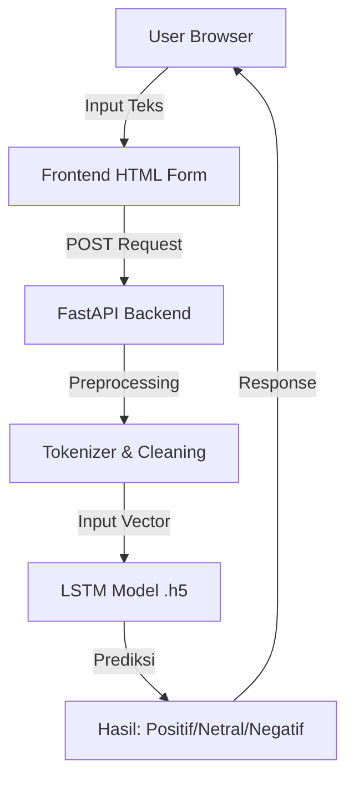

# 📊 DL-Sentiment-Analysis-Apk-Roblox


**Aplikasi Web Analisis Sentimen Ulasan Roblox**

Aplikasi ini adalah sistem *Sentiment Analysis* berbasis Web yang dirancang untuk menganalisis ulasan pengguna game **Roblox** dari Google Play Store. Menggunakan teknologi **Deep Learning (LSTM)** dan **FastAPI**, aplikasi ini mampu mengklasifikasikan sentimen ulasan ke dalam tiga kategori (Positif, Netral, Negatif) secara *real-time*.

## 🚀 Fitur Utama

* 🔍 **Analisis Teks Bahasa Indonesia:** Dioptimalkan untuk memproses ulasan dalam Bahasa Indonesia.
* 🧠 **Deep Learning LSTM:** Menggunakan arsitektur *Long Short-Term Memory* untuk akurasi prediksi yang tinggi.
* ⚡ **FastAPI Backend:** Performa tinggi dan *latency* rendah dalam memproses request.
* 🌐 **Antarmuka Web Sederhana:** Menggunakan HTML + Jinja2 yang ringan dan mudah digunakan.
* 🧪 **Preprocessing Otomatis:** Termasuk *cleaning*, *tokenizing*, dan *stopword removal*.
* 🧩 **Virtual Environment:** Manajemen dependensi yang terisolasi.

---

## 🏗️ Arsitektur Sistem

Alur data dari pengguna hingga mendapatkan hasil prediksi adalah sebagai berikut:



---

## 📂 Struktur Direktori

Berikut adalah susunan folder dan file dalam proyek ini agar mudah dipahami:

```text
sentiment-analysis-roblox/
│
├── app.py                 # File utama aplikasi (FastAPI & Logic)
├── model.h5               # Model LSTM yang sudah dilatih (Weights)
├── tokenizer.pkl          # File tokenizer untuk preprocessing
├── requirements.txt       # Daftar pustaka Python yang dibutuhkan
│
├── templates/             # Folder template HTML (Jinja2)
│   └── index.html         # Antarmuka utama aplikasi
│
└── README.md              # Dokumentasi proyek ini
```
## 🧪 Dataset & Model

### 📂 Dataset
Data yang digunakan dalam proyek ini berasal dari ulasan pengguna **Roblox** di Google Play Store. Sebelum masuk ke dalam model, data mentah telah melalui tahapan *preprocessing* berikut:

* 🧹 **Data Cleaning:** Menghapus karakter non-alfanumerik, simbol, dan emoji.
* 🔡 **Case Folding:** Mengonversi seluruh teks menjadi huruf kecil (*lowercase*).
* ✂️ **Tokenization:** Memecah kalimat menjadi potongan kata individu.
* 🚫 **Stopword Removal:** Menghapus kata-kata umum yang tidak memiliki makna sentimen yang signifikan.
* 🏷️ **Labeling:** Pelabelan sentimen otomatis menggunakan pendekatan berbasis *Lexicon*.

### 🧠 Arsitektur & Performa Model

Model dibangun menggunakan Deep Learning dengan arsitektur **LSTM (Long Short-Term Memory)** yang efektif untuk data teks sekuensial.

| Parameter | Keterangan |
| :--- | :--- |
| **Arsitektur** | `Embedding Layer` → `LSTM Layer` → `Dense Layer (Softmax)` |
| **Kelas Output** | 3 Kelas (Positif, Netral, Negatif) |
| **Akurasi Pengujian** | **±94%** |
| **Format Model** | `.h5` (Keras/TensorFlow) |


## 🔧 Instalasi & Persiapan
Ikuti langkah-langkah berikut untuk menjalankan aplikasi di komputer lokal Anda.

1️⃣ Clone Repository
```Bash
https://github.com/donnycharles88/DL-Sentiment-Analysis-Apk-Roblox.git
```
2️⃣ Membuat Virtual Environment
Disarankan menggunakan venv agar library tidak bentrok dengan sistem utama.

``` Bash

# Membuat environment bernama 'venv'
python -m venv venv
```
## Aktifkan venv:

Windows:
```Bash

venv\Scripts\activate
```
macOS / Linux:

```Bash

source venv/bin/activate
```
(Jika berhasil, terminal akan menampilkan prefix (venv))

3️⃣ Install Dependency
Install semua library yang dibutuhkan (FastAPI, TensorFlow, Uvicorn, NLTK, dll).

```Bash

pip install -r requirements.txt
```
4️⃣ Download Resource NLTK
Aplikasi membutuhkan data tokenizer dan stopwords dari NLTK. Jalankan perintah berikut di terminal:

```Bash

python -c "import nltk; nltk.download('punkt'); nltk.download('punkt_tab'); nltk.download('stopwords')"
```
▶️ Menjalankan Aplikasi
Jalankan server menggunakan Uvicorn:

```Bash

uvicorn app:app --reload
```
Jika server berhasil berjalan, buka browser dan akses alamat berikut:
```
👉 http://127.0.0.1:8000'
```
